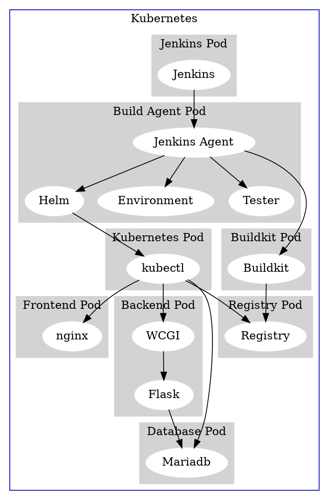

# 系统实现文档

## 运维

- 使用Softether配合nginx+ssl_preread实现多地址连接聚合防止运营商QoS&HE隧道QoS的GFW穿透
- 使用microk8s搭建Kuberteres集群
- 使用Jenkins进行与git集成的持续交付&持续部署
- 使用Buildkit进行带缓存加速的容器镜像构建
- 使用Helm进行容器配置文件管理

### 系统架构




## 前端

### 整体实现

- 基于Vue.js进行编写
- 使用vue-cli搭建项目脚手架
- 使用Vuex存储全局状态
- 采用了webpack打包代码

### 首页（前台）


#### 流程

1. 用户选择需要的日期
2. 用户选择需要的城市，城市列表从后端获取
    - 请求地址：'/citylist'
3. 用户点击查询
4. 数据通过socket传到后端服务器
5. 后端服务器通过RESTful API传到算法微服务
    - 请求地址： `/weather`
6. 算法微服务将返回的数据通过response传回后端服务器
7. 后端服务器发送消息，将数据传回前端
8. 前端调用callback，将数据显示在表格和echarts中


### 管理系统（后台）

#### 流程

##### 登录

1. 输入用户名和密码，移动验证码滑块
2. 向服务器发出请求，如果验证用户名及密码正确，返回token；否则返回400
    - 请求地址：`/user/login`
3. 在加载后台面板主界面前，向服务器发出请求，获取用户信息，并将获取到的信息存储到vuex里，供之后调用
    - 请求地址：`/user/info`
4. 后端面板根据vuex存的permission信息，动态的对按钮进行渲染，实现细粒度的权限控制


##### 用户管理

1. 用户点击用户管理界面
2. 向服务器发出请求，获取用户列表，然后将获取到的信息放在table里显示
    - 请求地址：`/user/list`
3. 如果用户要增/删/改用户，那么向后端发出请求，将相应的数据post/put/delete到后端
    - 请求地址：`/user`, `/user/id`

##### 角色管理

1. 用户点击角色管理界面
2. 向服务器发出请求，获取角色列表，然后将获取到的信息放在table里显示
    - 请求地址：`/user/list`
3. 如果用户要增/删/改用户，那么向后端发出请求，将相应的数据post/put/delete到后端
    - 请求地址：`/user`, `/user/id`

##### 上传头像
1. 点击上传头像按钮
2. 选择头像后，开始上传，向服务器发送请求
    - 请求地址: `/upload`
3. 服务器收到请求后，将数据转发到图床。这里使用的是sm.ms的公共api。
4. 服务器向前端返回是否成功的数据

## 后端

### 整体实现
- 后端采用Flask的框架
- 使用flask-httpauth进行鉴权
- 使用flask-sqlalchemy进行数据库连接
- 使用flask-socketio进行与前端的socket连接
- 使用flask-cors解决跨域问题
- 使用flask-restful进行RESTful API的搭建
- 利用itsdangerous进行token的生成和鉴权
- 使用werkzeug.security进行对用户的密码加密，并存储到数据库中

### 流程

#### 用户及角色和权限的增删改查

1. 收到前端的数据后，根据前端发送的数据到对应的数据库中去查询
2. 根据前端数据中的需求进行增删改查
3. 返回是否成功的结果（如果是查，那么返回用户/角色和权限的信息）

#### 生成token
1. 根据前端发来的用户名和密码在数据库中查询，看是否存在该用户且密码是否正确
2. 如果均正确，返回用户id
3. 利用itsdangerous中的TimedJSONWebSignatureSerializer生成token并返回

#### token鉴权
1. 获得token，并利用TimedJSONWebSignatureSerializer来鉴定其真伪以及有效性
2. 如果token为真，那么将其反序列化，得到用户id
3. 在数据表中查询该用户id是否存在，如果存在，说明鉴权成功

#### 算法服务器数据转发
1. 获得前端发来的数据，并且将其转发至算法微服务上
    - 请求地址：`/weather`
2. 等待算法服务器运算结束返回结果，再将结果返回至前端

## 算法

### 整体实现
- 使用EMD分解天气数据的本征模函数及噪声

    ``` python
    emd.emd(series, None, 6)
    imfs, res = emd.get_imfs_and_residue()
    res = res.reshape(1,-1)
    ```
- 创建多层LSTM模型
    ``` python
    model = Sequential([
                layers.LSTM(self.rnn_hedden_size,
                     input_shape=self.lstm_input_shape,
                     return_sequences=True),
                layers.LSTM(self.rnn_hedden_size),
                layers.Dense(self.forward_days)
            ])
    ```
- 使用指定城市的历史数据训练模型
    ``` python
    # 组成训练数据
    trian_X, train_y = self.sample_to_data(self.X, self.y)
    
    # 拿出一部分不去训练。用来检验算法性能
    X_train, X_validate, y_train, y_validate = train_test_split(trian_X,train_y,
                                                                test_size=self.test_size)
    
    model.fit(X_train, 
                    y_train,
                    epochs=self.epochs, 
                    validation_data=(X_validate, y_validate), 
                    callbacks=[checkpoint],
                    batch_size=self.batch_size)

    ```
- 将指定预测日期的前20日数据作为参考数据传入模型并得出结果
    ``` python
    # 组成测试数据
    d1 = datetime.datetime.strptime('2020-7-7', '%Y-%m-%d')
    d2 = datetime.datetime.strptime(date, '%Y-%m-%d')
    d = d1 - d2
    
    X_test = self.X[-(self.look_back + d.days):(-d.days)]
    X_test = np.expand_dims(X_test, axis=0)
    y_predict = self.model.predict(X_test)
    y_predict = self.scaler_series.inverse_transform(y_predict.reshape(-1,1)).ravel()
    ```

### 库

- numpy
- pandas
- tensorflow
- keras
- PyEMD

### 流程

1. 读取数据文件并加载数据
2. 使用EMD方法进行数据分解
3. 将数据传入LSTM进行模型训练
4. 加载已训练好的模型,读取所需参考数据
5. 使用模型进行预测并输出结果