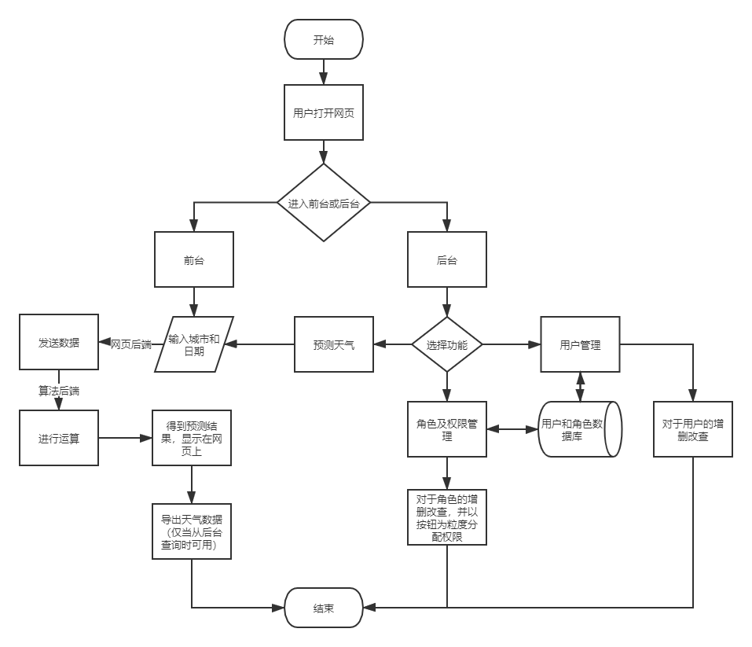
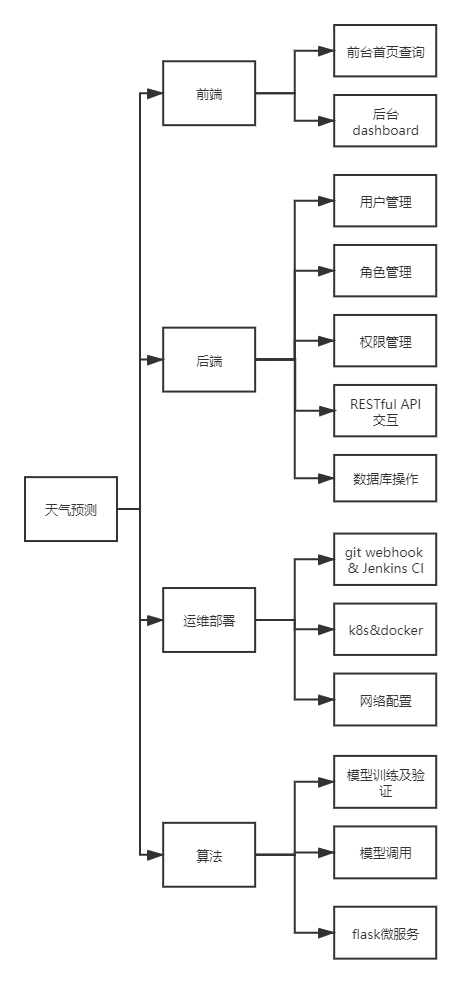
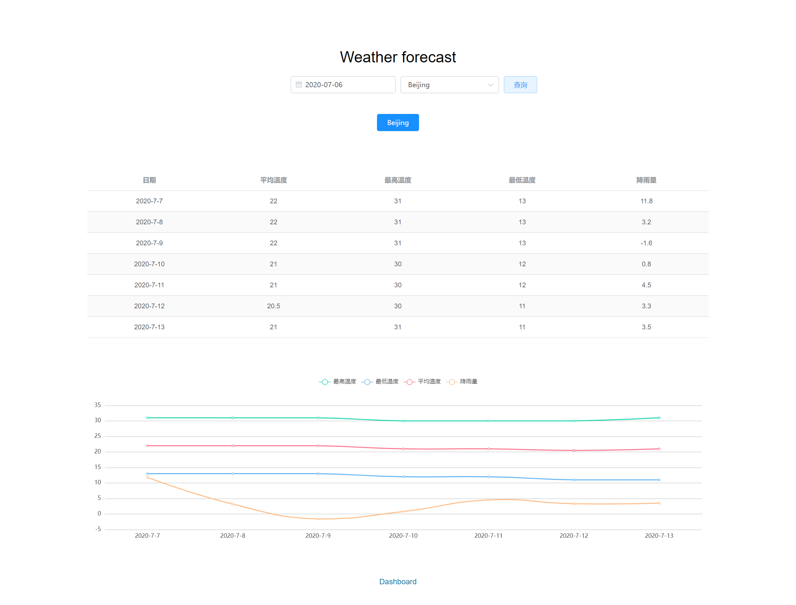
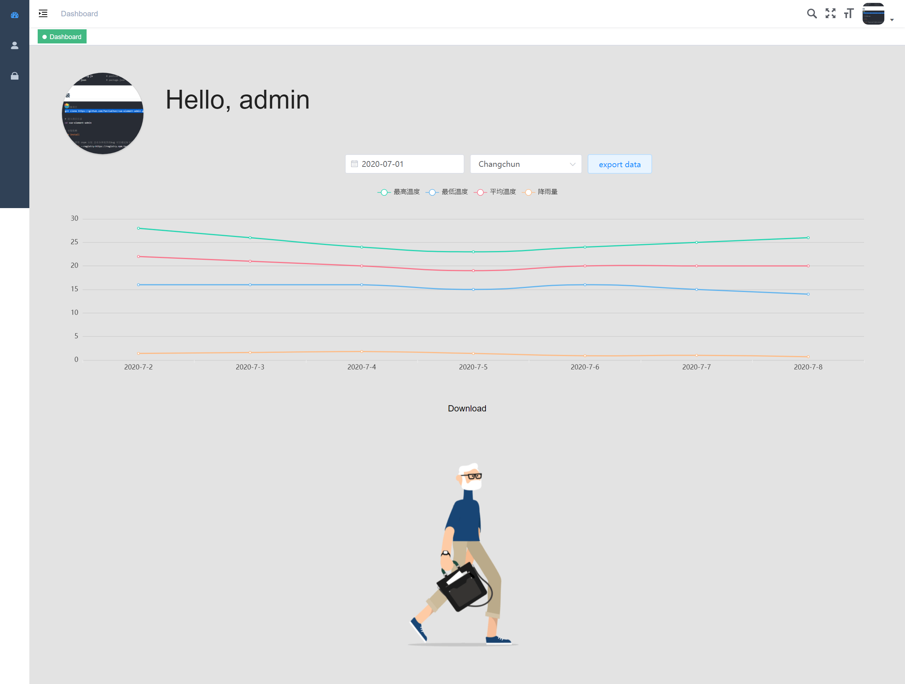
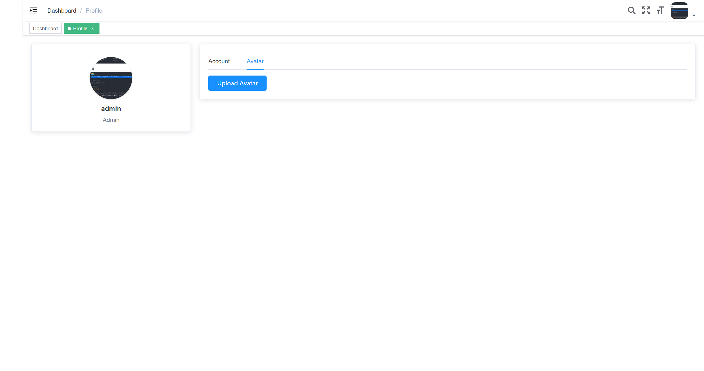
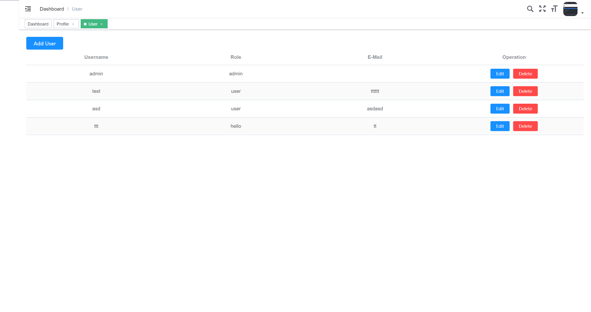
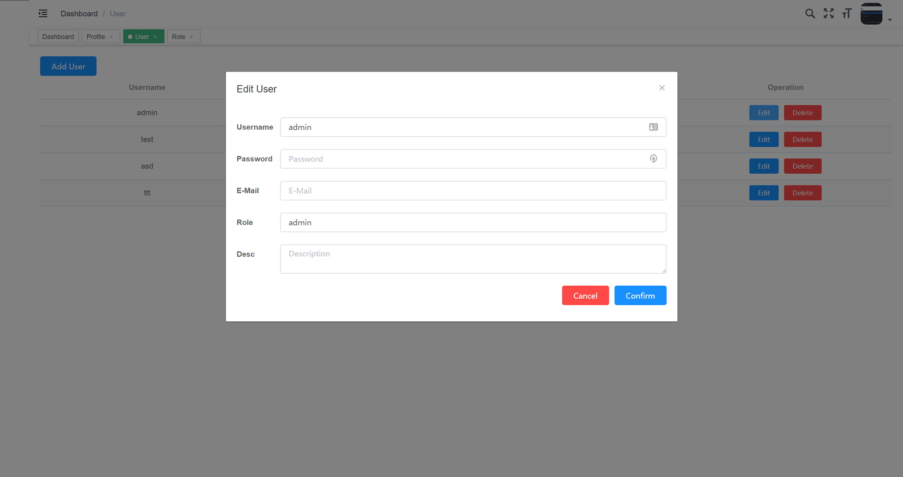
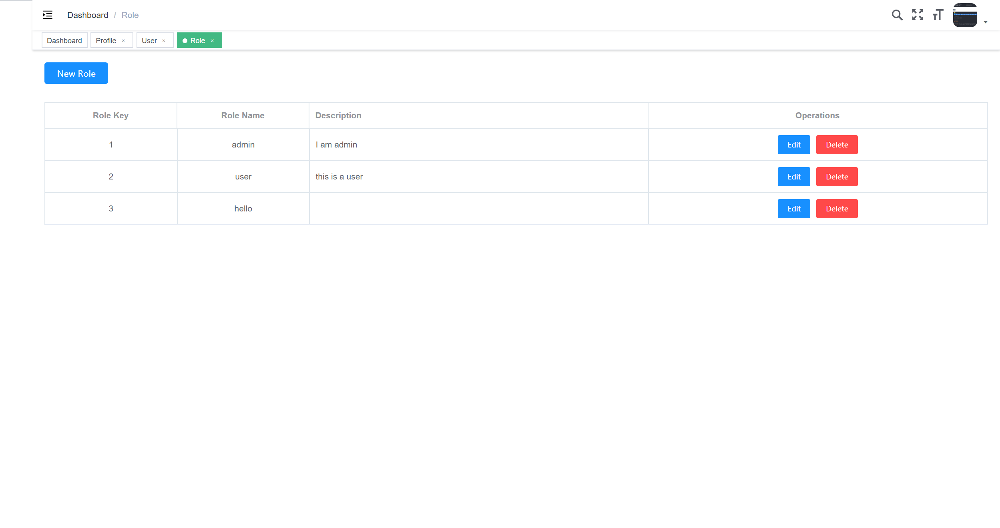
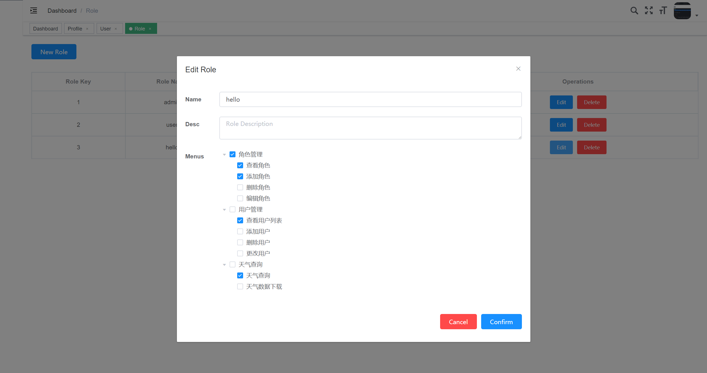

# 1 概要设计
## 1.1 处理流程

图1 项目流程图

## 1.2 总体结构设计

图2 总体架构图

整体架构，如上图所示，主要分为数据处理，算法预测，图表绘制，前端展示，用户管理五部分。   

其中xxxx部分主要包含xxx，xxx n个模块，主要涉及xxxx的技术；   

…… 

用户管理部分主要包含部门管理、角色管理、权限管理三个模块，主要涉及xxxx的技术。

## 1.3 功能设计

## 1.4 用户界面设计

（1）登录界面

（截图）   

* 提供用户输入用户名、密码、验证码信息进行登录操作的图形界面接口      

（2）天气预报界面

（截图）   

* 提供用户得到输入位置的未来天气预报的图形界面接口   
* 提供用户对查看天气的城市进行选择的操作   

（3）用户管理界面

（截图）   

* 提供管理员得到用户名单的图形界面接口
* 提供管理员对用户进行增加、删除、编辑的操作

（4）权限管理界面

（截图）

* 提供管理员查看用户权限的图形界面接口
* 提供管理员对用户权限进行编辑的操作

（5）个人信息界面

（截图）

* 提供用户查看个人信息的图形界面接口
* 提供用户上传图片作为头像的图形界面接口
* 提供用户输入用户名、邮箱等信息进行信息更改的图形界面接口

图x 前台界面

图 后台主页

## 1.5 接口设计
### 后端接口

#### 天气信息接口

- 地址： `/weather`
- 方法：`get`
- 参数：
  - `city`：需要预测的城市，格式为`str`
  - `date`：需要预测的日期，格式为`int`时间戳
- 返回数据：未来七天该城市的预测气象数据

#### 登录接口

- 地址：`/user/login`
- 方法：`post`
- 参数：
  - `username`
  - `password`
- 返回数据：登陆令牌

#### 用户接口

- 地址： `/user`, `/user/<int:user_id>`
- 方法：`post`, `delete`, `put`
- 参数：
  - `username`：用户名
  - `password`：密码
  - `role`：用户角色
  - `email`：用户邮箱

#### 用户信息接口

- 地址：`/user/info`
- 方法：`get`
- 参数：
  - `token`：待获取信息用户的令牌
- 返回数据：用户信息

#### 城市列表接口

- 地址：`/citylist`
- 方法：`get`
- 参数：无
- 返回数据：可预测的城市列表

#### 注销接口

- 地址：`/user/logout`
- 方法：`get`
- 参数：无
- 返回数据：注销是否成功

#### 用户列表接口

- 地址：`/user/list`
- 方法：`get`
- 参数：无
- 返回数据：现有用户的列表

#### 头像上传接口

- 地址：`/upload`
- 方法：`post`
- 参数：待上传头像的二进制文件
- 返回数据：上传是否成功

#### 角色信息接口

- 地址：`/roles`, `/role/<int:role_id>`
- 方法：`get`, `put`, `post`
- 参数：
  - `key`：待更改的角色id
  - `name`：角色更改后的名字
  - `description`：角色更改后的描述
  - `auth`：角色更改后的权限
- 返回数据：
  - `get`：返回所有角色的列表
  - `post`,`put`：是否角色更改/添加成功

### 算法接口

#### 天气预测接口

- 地址： `/weather`
- 方法：`get`
- 参数：
  - `city`：需要预测的城市，格式为`str`
  - `date`：需要预测的日期，格式为`int`时间戳
- 返回数据：未来七天该城市的预测气象数据

## 数据库设计
表  用户表（表名：user）

| 列名          | 数据类型       | 字段大小 | 必填字段 | 默认值                                               | 说明         |
| ------------- | -------------- | -------- | -------- | ---------------------------------------------------- | ------------ |
| id            | AUTO_INCREMENT | int      | Y        | (NULL)                                               | 主键         |
| username      | string         | 32       | Y        | (NULL)                                               | 用户名       |
| password_hash | string         | 128      | Y        | (NULL)                                               | 加密后的密码 |
| role          | string         | 128      | Y        | 'user'                                               | 角色         |
| avatar        | string         | 128      | Y        | 'https://jandan.net/ofk.gif'                         | 头像地址     |
| description   | string         | 128      | Y        | 'This guy is lazy, no details have been filled yet.' | 描述         |

表  角色表（表名：user）

| 列名             | 数据类型       | 字段大小 | 必填字段 | 默认值 | 说明     |
| ---------------- | -------------- | -------- | -------- | ------ | -------- |
| id               | AUTO_INCREMENT | int      | Y        | (NULL) | 主键     |
| role_name        | string         | 128      | Y        | (NULL) | 角色名   |
| role_description | string         | 128      | Y        | (NULL) | 角色描述 |
| role_permission  | string         | 128      | Y        | (NULL) | 角色权限 |

## 运行设计

……   

## 错误/异常处理设计

### 错误/异常输出信息

……

### 错误/异常处理对策

……   

## 系统配置策略

>针对我们项目的特点，不同模块的计算要求是不同的，而且对资源的占用量也是不同的，更重要的是它们对于我们服务的重要程度也是不同的。所以，不同模块所在的服务器配置情况也是不同的。此外，我们注意到核心服务部分可以进一步作出细分，进行一定程度的上的并行处理，如下图所示。从而使整体服务器集群的性能进一步提升。**(根据我们的来改吧)**   

……   

## 系统部署方案
**（集群）**

……

## 其他相关技术与方案

……   

