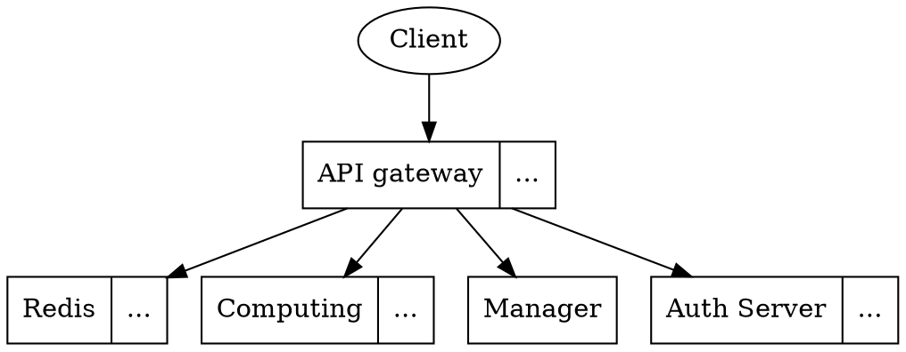
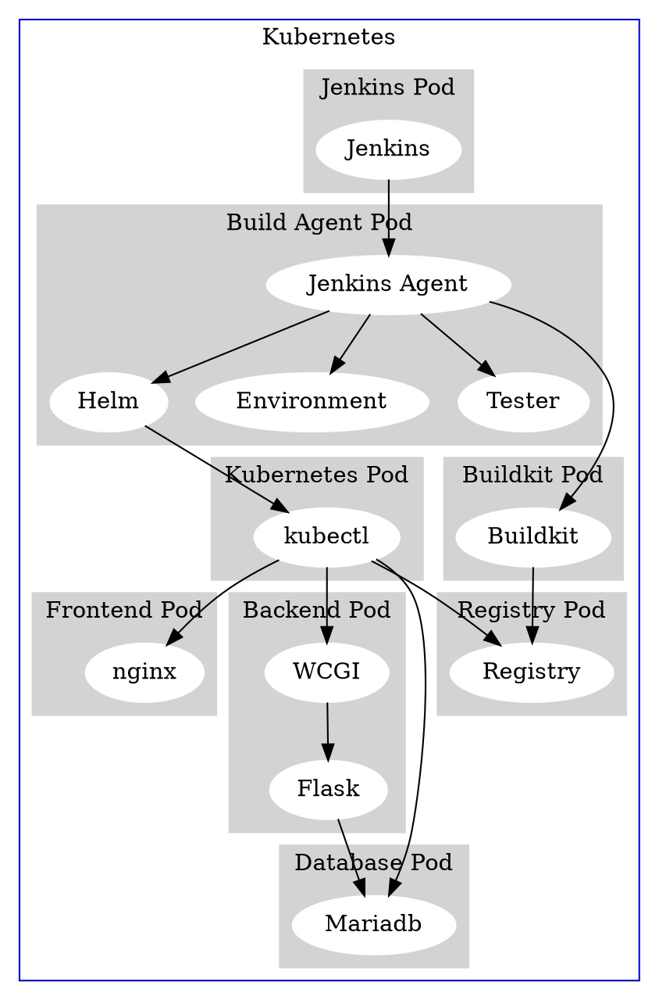

# 系统设计文档

## 处理流程

图1 项目流程图

用户通过打开网页进入系统，可以选择进入前台或者后台。

系统最主要的功能为预测天气。用户从前台或者后台都可以进入该模块。用户输入城市和日期，以此查询对应气象预报情况。网页后端将用户输入的信息及对应的数据发送给算法后端，算法运算得到预测结果之后，传回前端并显示在网页上。当用户为从后台进入预测天气模块时，还能够进行导出天气数据的操作。

系统后台还具有用户管理模块、角色及权限管理模块。此两项模块通过对用户和角色数据库的调用，实现角色和用户的增删改查功能。

## 技术栈设计

前端：Vue.js + Vuex + webpack + websocket

后端：Python Flask + websocket + RESTful API

算法：Python Flask微服务 + Tensorflow + Keras + LSTM + EMD

数据库：MySQL + Redis

## 总体结构设计

整体架构如上图所示，主要可分为前端、后端、运维部署和算法四个部分，其中：
- 前端
    - 前台首页查询
    提供首页上的天气数据查询功能，用户可以选择日期和城市，然后进行查询；预测出来的数据将通过websocket从后端发至浏览器，并且通过echarts和表格显示
    - 后台dashboard
    提供后台管理界面的功能，用户可以在dashboard进行如下操作：
        - 查询天气，并导出数据报表
        - 对于用户的增删改查
        - 对于角色的增删改查，并且对于角色进行细粒度的权限划分
        - 查看个人资料和更换头像
- 后端
    - 用户管理
    提供用户管理逻辑，对用户的信息、角色等进行增删改查
    - 角色管理
    提供角色管理逻辑，对角色的信息进行增删改查
    - 权限管理
    提供权限管理逻辑，对角色权限进行增删改查
    - RESTful API交互
    为后端功能提供RESTful API，便于进行资源的增删改查，且十分优雅
    - 数据库操作
    为后端几个管理模块提供统一的数据库操作接口
- 运维部署
    - 使用Softether配合nginx+ssl_preread实现多地址连接聚合防止运营商QoS&HE隧道QoS的GFW穿透
    - 使用microk8s搭建Kuberteres集群
    - 使用Jenkins进行与git集成的持续交付&持续部署
    - 使用Buildkit进行带缓存加速的容器镜像构建
    - 使用Helm进行容器配置文件管理
- 算法
    - 模型训练及验证
    读取地区的气象数据文件，用该地区全部数据训练TMAX、TMIN、TAVG、PRCP四种指标的模型，在训练过程中每次循环计算loss、mse和mae，并根据结果进行修正。最终     将四种模型分别存储以便后续使用。
    - 模型调用
    调用已训练模型，读取数据文件并选取预测开始日期的前20天数据作为参考，用已训练模型做出预测结果。

## 功能设计

### 前台首页模块

#### 功能描述

提供用户首页查询的入口，并且提供用户选择日期和城市的选项，供用户进行天气数据查询。

#### 性能描述

- 前端渲染时间 < 1s

#### 输入

用户的输入数据（日期、城市等）；获取到的算法数据

#### 输出

渲染好的首页页面

#### 程序逻辑

用户通过选择前端的组件来进行日期、城市等的选择；然后前端将用户输入数据发送至后端，并且取得预测天气数据；将预测天气数据通过echarts图表和表格的形式展现出来。

#### 限制条件

用户输入必须是合法的；不支持IE系列浏览器。

### 后台dashboard模块

#### 功能描述

提供管理后台的前端，供操作者进行用户的增删改查、角色及相应权限的增删改查、天气数据报表的下载，以及操作者个人信息的维护。

#### 性能描述

- 后台页面渲染时间 < 1s

#### 输入

用户的操作

#### 输出

根据用户操作，渲染出不同操作对应的后台管理页面（角色管理、用户管理等）

#### 程序逻辑

用户通过选择前端的组件来进行功能的选择；然后前端将用户输入数据发送至后端，并且取得相应的数据（用户列表、用户信息、角色列表、角色权限等）显示在前端，并提供相应组件进行增删改查的操作。

#### 限制条件

用户必须注册，并具有相应操作的权限。

### 用户管理模块

#### 功能描述

提供用户管理的api，便于操作者执行对用户的增删改查操作

#### 性能描述

- 调用数据库时间 < 0.1s
- 运算时间 < 0.1s

#### 输入

- 增：新增用户的数据
- 删：待删除用户的id
- 改：待更改用户的id、更改后的信息
- 查：待查询用户的id

#### 输出

- 增、删、改：操作结果（成功/失败）
- 查：待查询用户的个人信息

#### 程序逻辑

- 接收前端传来的数据
- 通过接收数据类型，判断进行什么操作（增删改查）
    - 增：在数据表中增加一行，并且将各个字段依照数据进行赋值
    - 删：根据接收数据中的id，寻找到数据表中的行，并进行删除操作
    - 改：根据接收数据中的id，寻找到数据表中的行，并且依照接收数据进行相应修改
    - 查：根据接收数据中的用户名，寻找到数据表中的行，并且将该行数据返回

#### 限制条件

操作者必须具有相应权限

### 角色及权限管理模块

#### 功能描述

提供用户管理的api，便于操作者执行对角色及权限的增删改查操作

#### 性能描述

- 调用数据库时间 < 0.1s
- 运算时间 < 0.1s

#### 输入

- 增：新增角色的数据
- 删：待删除角色的id
- 改：待更改角色的id、更改后的信息
- 查：待查询角色的id

#### 输出

- 增、删、改：操作结果（成功/失败）
- 查：待查询用户的个人信息

#### 程序逻辑

- 接收前端传来的数据
- 通过接收数据类型，判断进行什么操作（增删改查）
    - 增：在数据表中增加一行，并且将各个字段依照数据进行赋值
    - 删：根据接收数据中的id，寻找到数据表中的行，并进行删除操作
    - 改：根据接收数据中的id，寻找到数据表中的行，并且依照接收数据进行相应修改
    - 查：根据接收数据中的角色名，寻找到数据表中的行，并且将该行数据返回

#### 限制条件

操作者必须具有相应权限

### 模型训练模块

#### 功能描述
读取某地区的气象数据，用该地区全部数据分别训练TMAX、TMIN、TAVG、PRCP四种指标的模型，将四种模型分别存储以便后续使用。

#### 性能描述
由于数据在输入到LSTM模型中训练前做了EMD分阶的预处理，使其每一个固有模态规律性较好，白噪对预测结果的影响减少，从而使得loss函数降至0.0006，并且解决过拟合问题。训练过程中loss函数和mse、mae逐步递减并达到一个很小值。

#### 输入
相应地区的数据.csv文件。

#### 输出
训练好模型的.h5文件。

#### 程序逻辑
读取文件内数据，依次取每个指标的全部数据，先进行EMD分解，将数据分解为７个固有模态和一个Res(此处为数据白噪)，从一维数据转化为8维向量。创建两个LSTM层和一个全连接层，设置epoches为50，batch_size为512进行模型训练,将训练好的模型以.h5的格式输出并储存。

#### 限制条件
输入的数据应为包含指定地区TMAX、TMIN、TAVG、PRCP四种指标的.csv文件，并且数据量应足够大。

### 预测模块

#### 功能描述
根据输入的城市名读取相应的.csv数据文件，并加载相应模型，输出预测的TMAX、TMIN、TAVG、PRCP四类数据在输入日期后7天的数据。加载训练好的模型，调用predict()函数获得结果。

#### 性能描述
计算预测结果时间 < 30s

#### 输入
所要预测的城市名、预测开始时间、预测参考数据的.csv文件、训练好的预测模型。

#### 输出
内容为输入城市的TMAX、TMIN、TAVG、PRCP四种指标的未来七天预测结果的nparray。

#### 程序逻辑
读取前20日数据作为参考，将数据输入已训练好的LSTM模型，将输出数据reshape为所需格式。

#### 限制条件
需要预先训练模型，并且需要输入日期前20日数据无缺项。

## 用户界面设计

用户界面：

（1）登录界面

* 提供用户输入用户名、密码、验证码信息进行登录操作的图形界面接口      

（2）（前台）气象预测界面

* 提供用户得到输入位置的未来气象预测的图形界面接口   
* 提供用户对查看天气的日期、城市进行选择的操作   

（3）（后台）气象预测界面

* 提供用户得到输入位置的未来气象预测的图形界面接口
* 提供用户对查看天气的日期、城市进行选择的操作
* 提供用户导出气象预测数据生成文件并下载的操作

（3）用户管理界面

* 提供管理员得到用户名单的图形界面接口
* 提供管理员对用户进行增加、删除、编辑的操作

（4）权限管理界面

* 提供管理员查看用户权限的图形界面接口
* 提供管理员对用户权限进行编辑的操作

（5）个人信息界面

* 提供用户查看个人信息的图形界面接口
* 提供用户上传图片作为头像的图形界面接口
* 提供用户输入用户名、邮箱等信息进行信息更改的图形界面接口

## 接口设计

### 后端接口

#### 天气信息接口

- 地址： `/weather`
- 方法：`get`
- 参数：
  - `city`：需要预测的城市，格式为`str`
  - `date`：需要预测的日期，格式为`int`时间戳
- 返回数据：未来七天该城市的预测气象数据

#### 登录接口

- 地址：`/user/login`
- 方法：`post`
- 参数：
  - `username`
  - `password`
- 返回数据：登录令牌

#### 用户接口

- 地址： `/user`, `/user/<int:user_id>`
- 方法：`post`, `delete`, `put`
- 参数：
  - `username`：用户名
  - `password`：密码
  - `role`：用户角色
  - `email`：用户邮箱

#### 用户信息接口

- 地址：`/user/info`
- 方法：`get`
- 参数：
  - `token`：待获取信息用户的令牌
- 返回数据：用户信息

#### 城市列表接口

- 地址：`/citylist`
- 方法：`get`
- 参数：无
- 返回数据：可预测的城市列表

#### 注销接口

- 地址：`/user/logout`
- 方法：`get`
- 参数：无
- 返回数据：注销是否成功

#### 用户列表接口

- 地址：`/user/list`
- 方法：`get`
- 参数：无
- 返回数据：现有用户的列表

#### 头像上传接口

- 地址：`/upload`
- 方法：`post`
- 参数：待上传头像的二进制文件
- 返回数据：上传是否成功

#### 角色信息接口

- 地址：`/roles`, `/role/<int:role_id>`
- 方法：`get`, `put`, `post`
- 参数：
  - `key`：待更改的角色id
  - `name`：角色更改后的名字
  - `description`：角色更改后的描述
  - `auth`：角色更改后的权限
- 返回数据：
  - `get`：返回所有角色的列表
  - `post`,`put`：是否角色更改/添加成功

### 算法接口

#### 天气预测接口

- 地址： `/weather`
- 方法：`get`
- 参数：
  - `city`：需要预测的城市，格式为`str`
  - `date`：需要预测的日期，格式为`int`时间戳
- 返回数据：未来七天该城市的预测气象数据

## 数据库设计

表  用户表（表名：user）

| 列名          | 数据类型       | 字段大小 | 必填字段 | 默认值                                               | 说明         |
| ------------- | -------------- | -------- | -------- | ---------------------------------------------------- | ------------ |
| id            | AUTO_INCREMENT | int      | Y        | (NULL)                                               | 主键         |
| username      | string         | 32       | Y        | (NULL)                                               | 用户名       |
| password_hash | string         | 128      | Y        | (NULL)                                               | 加密后的密码 |
| role          | string         | 128      | Y        | 'user'                                               | 角色         |
| avatar        | string         | 128      | Y        | 'https://jandan.net/ofk.gif'                         | 头像地址     |
| description   | string         | 128      | Y        | 'This guy is lazy, no details have been filled yet.' | 描述         |

表  角色表（表名：user）

| 列名             | 数据类型       | 字段大小 | 必填字段 | 默认值 | 说明     |
| ---------------- | -------------- | -------- | -------- | ------ | -------- |
| id               | AUTO_INCREMENT | int      | Y        | (NULL) | 主键     |
| role_name        | string         | 128      | Y        | (NULL) | 角色名   |
| role_description | string         | 128      | Y        | (NULL) | 角色描述 |
| role_permission  | string         | 128      | Y        | (NULL) | 角色权限 |

## 错误/异常处理设计

### 错误/异常输出信息

1. 算法接口暂时不可用
2. 数据库无法访问
3. 后端接口无法访问

### 错误/异常处理对策

1. 算法接口暂时不可用
查看算法错误输出，寻找错误来源。可尝试重新训练模型、更换数据集、重新调整算法微服务等操作。
2. 数据库无法访问
查看错误输出，确认数据库不能访问的原因（url错误/SQL语句错误/数据库数据意外丢失/...），并且相应地进行修复
3. 后端接口无法访问
通过浏览器，查看是否正确发出请求。如果不正确，说明前端有问题，相应地对于前端代码进行修改；如果正确，那么说明后端代码有bug，同样也是相应进行修复。

### 系统配置策略

针对我们项目的特点，不同模块的计算要求是不同的，而且对资源的占用量也是不同的，更重要的是它们对于我们服务的重要程度也是不同的。所以，不同模块所在的服务器配置情况也是不同的。此外，我们注意到核心服务部分可以进一步作出细分，进行一定程度的上的并行处理，如下图所示。从而使整体服务器集群的性能进一步提升。

### 系统部署方案

#### 自动部署流程

1. 拉取当前最新commit
2. 根据环境要求文件自动安装环境与依赖
3. 运行当前分支的测试
4. 部署容器构建
5. 将容器部署到测试环境
6. 进行部署后测试
7. 清理测试环境
8. 部署到生产环境

### 系统部署架构

