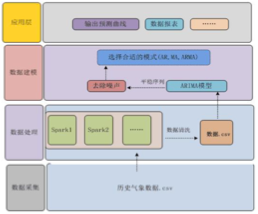

# **需求分析报告**

## **1** **项目背景和需求划分**

### 基本背景

天气历史数据的可获取性差，目前未出现个人定制的基于历史数据的天气预测网站。

为了解决以上的问题，让个人能够有效的掌握、有效的共享天气数据，及促进天气数据的信息化、规范化和集成化，经过听取多方意见、追加和完善大量实用功能，进而开发出一套基于历史数据预测天气的系统。

### 功能需求

在当今世界，人们已经习惯收听天气预报，结果自然会缺少属于个人的个性化分析，我们如果只是一味地听信普适性的天气预报，准确性低且浪费时间。本软件根据此需求进行开发的，让个人用户能够有效的掌握，有效的共享天气数据资源，保护个人资料，及促进天气数据的信息化、规范化和集成化，实现计算机的智能化管理，以提高效率和经济效益。

### 技术需求

 

### 性能需求

运行效率：能够满足需求

## **2** **目标和非目标**

### 目标

### 非目标

不在意运行和执行速度

不在意日访问量

## **3** **系统构架**

### **系统整体构架**

## **4** **数据流分析**

 

## **5** **项目特色**

### 技术特色

 

### 产品特色

 